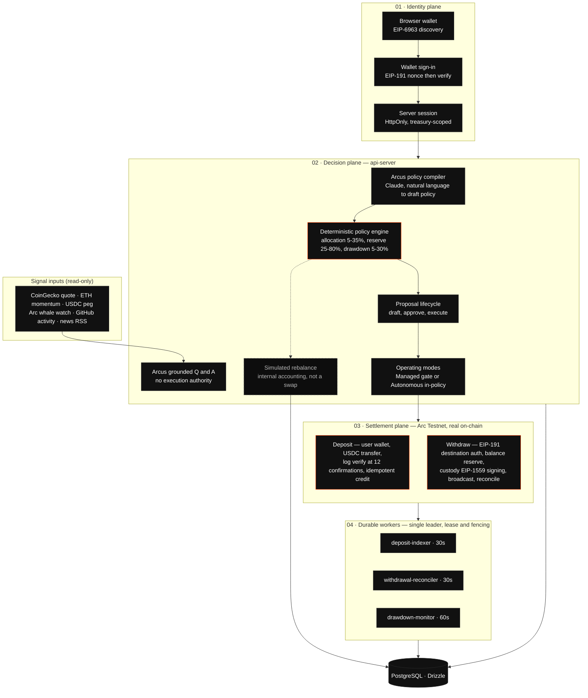

# Revo — System Architecture

Autonomous treasury intelligence on **Arc Testnet** (chainId `5042002`), settling in
native USDC (`0x3600000000000000000000000000000000000000`, 6 decimals).

Vector source: [`revo-architecture.svg`](./revo-architecture.svg)

---

## What is real, and what is not

This distinction is deliberate and is enforced throughout the product.

| Capability | Status |
| --- | --- |
| USDC deposits to the treasury | **Real Arc Testnet transactions** |
| USDC withdrawals from the treasury | **Real Arc Testnet transactions** |
| Deposit indexing, confirmations, reorg handling | **Real**, against Arc Testnet logs |
| Withdrawal reconciliation and refunds | **Real** |
| Strategic rebalance across sleeves | Simulated — internal accounting only |
| Yield sleeves (`aUSDC`, `sUSDC`) | Labels, not protocol positions |
| Emergency drill | Explicitly simulated |

Simulated rebalances are never presented as on-chain execution, in the UI, the API,
or the agent's own responses.

---

## Flow

---

## Custody and controls

- Per-treasury EOA, key material encrypted at rest with **AES-256-GCM envelope
  encryption**; the data key is wrapped by an HKDF-SHA256-derived master secret.
- The key is unsealed in memory only for the duration of a single signing call and
  is never persisted in plaintext. JavaScript offers no zeroization guarantee, so
  this is scope-limited in-memory use rather than cryptographic erasure.
- The chain guard rejects any `chainId` other than `5042002` before every read and
  every broadcast.
- Withdrawal caps: 25k per transaction, 50k per wallet per rolling 24h, 100k global
  per rolling 24h — all admin-configurable.
- Emergency pause blocks withdrawals, approvals, and mode changes. Safe mode makes
  policies and proposals review-only; it does not by itself block withdrawals.
- Role-based access: Strategist issues commands, Approver decides, Guardian controls
  mode and security. Every decision is written to an append-only audit trail.

## Runtime topology

| Service | Role |
| --- | --- |
| `artifacts/revo-treasury` | React + Vite frontend, marketing and operator console |
| `artifacts/api-server` | Express API, policy engine, custody, workers |
| `lib/api-spec` | OpenAPI contract — source of truth for client and validation |
| `lib/db` | Drizzle schema |

The browser and API communicate over relative `/api` URLs, so one build works in
both development and production.
