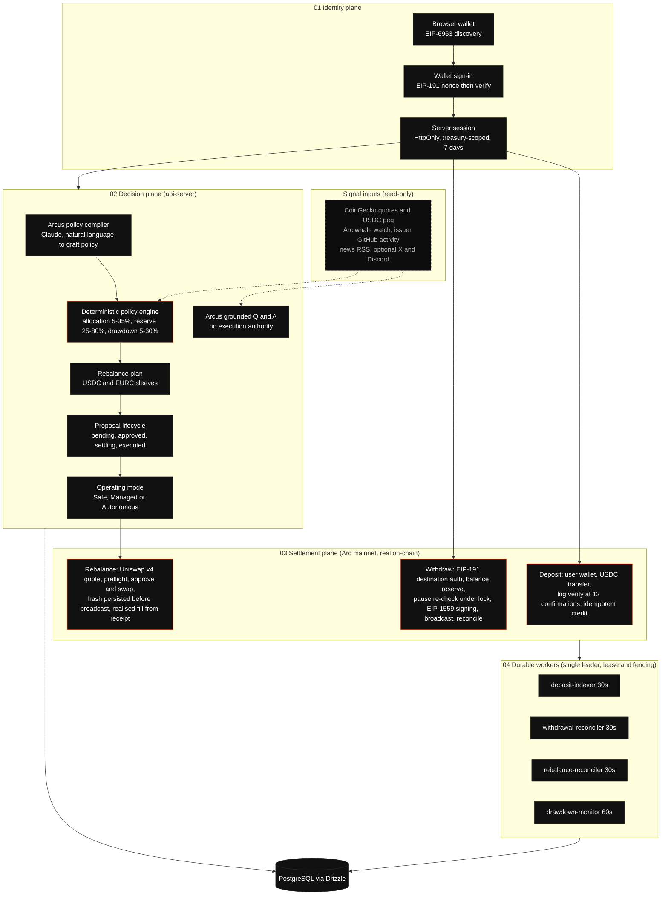

# Revo system architecture

Autonomous treasury intelligence built on **Arc mainnet** (chain id `5042`), settling in
USDC (`0x3600000000000000000000000000000000000000`, 6 decimals) and EURC
(`0xbEf5f6d51CB62b58e6A8f77868681825C6fe21c1`, 6 decimals), with gas paid in USDC.

Vector source: [`revo-architecture.svg`](./revo-architecture.svg). Re-render the PNG with
`pnpm --filter @workspace/scripts run render-architecture` after editing the SVG.

---

## What is real, and what is displayed

The distinction is deliberate and is enforced in the API, the console and the agent's own
answers.

| Capability | Status |
| --- | --- |
| USDC deposits to the treasury | Real Arc mainnet transactions, credited at 12 confirmations |
| USDC withdrawals from the treasury | Real Arc mainnet transactions, signed by the custody key |
| Deposit indexing, confirmations, reorg rewind | Real, against Arc mainnet logs |
| Withdrawal reconciliation and refunds | Real |
| Rebalance between the USDC and EURC sleeves | Real swaps on Arc through Uniswap v4, confirmed from receipts |
| Circle Gateway unified balance | Real read through Circle App Kit; a Gateway balance is not a wallet balance |
| Emergency drill | Explicitly simulated; it overlays the dashboard and never touches funds |
| Market, social and on-chain signals | Read-only inputs to the risk score and to Arcus, never a trigger for execution |

---

## Flow

Solid edges are real transactions or decision paths. Dashed edges are read-only inputs.

---

## Planes in detail

### Identity

- Any injected wallet is discovered with EIP-6963 and asked to sign a server-issued nonce
  (EIP-191). Nonces live for 5 minutes and are single use.
- The server issues an HttpOnly session cookie bound to exactly one treasury. Sessions last
  7 days.
- A wallet that has never been seen gets its own treasury provisioned on first sign-in and
  becomes its admin. Wallets listed in `OWNER_WALLET_ADDRESSES` are admins of the founding
  treasury.
- Roles: Viewer, Strategist, Approver, Guardian, Admin. Enabling autonomous execution and
  lifting the emergency pause are step-up actions that require a session less than 15 minutes
  old.

### Decision

- Arcus compiles plain English into a policy draft. Every number in the draft passes through the
  policy engine, which clamps allocation to 5 to 35% per sleeve, the liquid reserve to 25 to
  80% and the drawdown limit to 5 to 30%, then sizes the EURC sleeve by risk tolerance (4, 10 or
  16%). Sleeves whose drift is under 1 percentage point are left alone.
- Activating a policy supersedes the previous one and creates a rebalance proposal. In Managed
  mode an approver must approve it. In Autonomous mode it is approved and settled immediately,
  provided the mode allows it and the pause is not active. Safe mode makes policies and
  proposals review-only.
- Arcus can explain any state the console shows, but has no route that approves, signs, pauses
  or changes mode.

### Settlement

- Per-treasury EOA. The private key is sealed with AES-256-GCM envelope encryption; the data
  key is wrapped by a key derived with HKDF-SHA256 from `CUSTODY_MASTER_SECRET`. The key is
  unsealed in memory only for the duration of one signing call and never persisted in
  plaintext. JavaScript offers no zeroisation guarantee, so this is scope-limited in-memory use
  rather than cryptographic erasure.
- The chain guard rejects any `chainId` other than `5042` before every read and broadcast.
- Deposits are indexed from USDC transfer logs, credited once at 12 confirmations, and rewound
  on reorg. The indexer backfills up to 5000 blocks on a cold start.
- Withdrawals reserve balance under the custody lock, re-read the emergency pause under that
  same lock immediately before signing, sign an EIP-1559 transaction locally and broadcast.
  The reconciler confirms or refunds from receipts.
- Rebalances use the live Uniswap v4 USDC/EURC 0.05% pool (`fee 500`, `tickSpacing 10`) and
  every transaction is preflighted with `eth_call` before it is sent. The integration uses
  PoolManager `0x8366a39CC670B4001A1121B8F6A443A643e40951`, V4Quoter
  `0x8Dc178eFB8111BB0973Dd9d722ebeFF267c98F94`, StateView
  `0xF3334192D15450CdD385c8B70e03f9A6bD9E673b`, UniversalRouter
  `0x4fcA4a51Ab4F23A7447b3284fBd7D73289A89Fb1` and Permit2
  `0x000000000022D473030F116dDEE9F6B43aC78BA3`. An operator approval triggers settlement in
  the same request. The swap's transaction hash is persisted before broadcast so a
  crash cannot orphan it, and the realised fill is read from the receipt's transfer logs rather
  than from a balance delta. Gas comes out of the USDC balance being sent.
- The signer allowlist permits only USDC and EURC transfers and approvals, Permit2 approvals and
  UniversalRouter execution. Permit2 approvals are for the exact amount and expire with the swap.
- Every swap enforces a 1% maximum price impact, 2% maximum reference-price deviation, 30 bps
  slippage, at most 10% of the pool's 2% depth and a 180 second deadline. Stale prices are refused.
- The emergency pause is re-checked at signing. Circle blocklist and token pause status are
  checked before signing. Rebalances are also subject to absolute USD caps per trade and per day.
- Ledger balances are reconciled with chain balances, and any shortfall activates the pause.
- Withdrawal caps default to 25k per transaction, 50k per wallet per rolling 24 h and 100k
  global per rolling 24 h, and are admin-configurable.
- The emergency pause blocks withdrawals, policy and proposal approvals and autonomous
  execution, and prevents the mode moving away from Safe. Guardians can activate it; only an
  admin with a fresh sign-in can lift it.

### Durable workers

- One API process at a time holds a leased leadership record with a fencing token. The leader
  ticks every 15 seconds and runs each job on its own interval: `deposit-indexer` (30 s),
  `withdrawal-reconciler` (30 s), `rebalance-reconciler` (30 s) and `drawdown-monitor` (60 s).
- Because every in-flight settlement is persisted before the network call, a restart in the
  middle of a swap or a withdrawal is picked up by the reconciler rather than lost. For a
  rebalance that means: a broadcast swap whose receipt succeeded is marked executed, one that
  reverted goes back to pending, one that never reached broadcast goes back to pending, and one
  Arc has no record of is flagged as a critical alert for manual review and is never re-sent.
  Nothing is retried automatically on the operator's behalf.
- The drawdown monitor tracks each policy's drawdown episode and raises alerts when the limit is
  breached. With `DRAWDOWN_AUTO_DERISK=true` and Autonomous mode it also records that the
  auto de-risk gate was reached, but automated de-risk execution is deliberately not armed:
  no trade is made.

---

## Runtime topology

| Package | Role |
| --- | --- |
| `artifacts/revo-treasury` | React + Vite: marketing site, product docs, legal pages and the operator console |
| `artifacts/api-server` | Express 5 API: auth, policy engine, custody, settlement, workers |
| `lib/api-spec` | OpenAPI contract, the source of truth for the client and request validation |
| `lib/api-zod` | Zod schemas generated from the contract |
| `lib/api-client-react` | React Query client generated from the contract |
| `lib/db` | Drizzle schema and PostgreSQL connection |
| `lib/integrations-anthropic-ai` | Anthropic client used by Arcus |

The browser and API communicate over relative `/api` URLs, so one build works in development
and production. In production the router sends `/api` to the API process (health check at
`/api/healthz`) and everything else to the static web build.

## External dependencies

| Dependency | Used for | Failure behaviour |
| --- | --- | --- |
| Arc mainnet RPC providers | Every read and broadcast, with automatic failover and optional `ARC_RPC_URLS` override | Reads that fail are reported as unknown, never as zero; the valuation is marked incomplete |
| Uniswap v4 on Arc | Rebalance quotes, transaction preflight and swaps | Swap venue reported as unavailable; proposals wait |
| Tower Exchange public API | Token registry cross-check when `TOWER_API_KEY` is set | Optional; validation degrades, trades are unaffected |
| Circle Gateway via App Kit | Unified balance read | Panel shows unreachable, never an empty balance |
| Anthropic API | Arcus compilation and Q and A | Commands fail loudly; nothing is executed without a compiled policy |
| CoinGecko, GitHub, RSS, X, Discord | Signals | Each signal reports its own freshness; missing sources lower confidence rather than invent data |
